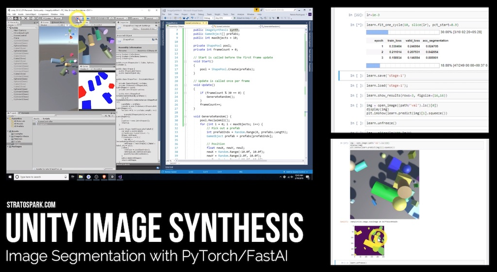

This project will help you get up to speed with generating synthetic training images in Unity. You don't need any experience with Unity, but experience with Python and the fastai library/course is recommended. By the end of the tutorial, you will have trained an image segmentation network that can recognize different 3d solids. 

Read more details on my [blog](https://blog.stratospark.com/generating-synthetic-data-image-segmentation-unity-pytorch-fastai.html)

Follow along with the [video tutorial](https://youtu.be/P4CCMvtUohA)

### Getting Started

1. Clone the repo
1. Open the project with Unity / Unity Hub (2018.3.2 recommended)
1. Open up the "Solids" scene
1. Create a "captures/train" and "captures/val" folders
1. Open up the SceneControl object and enable Save/grayscale if you want to do fastai training. Otherwise, leave those disabled and just see the annotations within Unity.
1. Press the Run button
1. Create a secondary Game window and change the Display to Display 3 for layer based category annotations.

